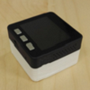

# M5Stack-3DPrintFiles
 
Hover cursor over image - some can be displayed in 3D or as a larger image.
 
 

|  |  |  | |||
|:-------|-------|------|--------|-----|--------|--------|
| M5Stack| Oscilloscope | Proto board | Open 6 pin | Tripod Thread | Sensor | Custom PCB  

  
  
  
  
  
  
 
 
  

|             Project Name           |  File type |  Author        | Link                                                            |
| ---------------------------------- |:---------- | :--------------| :---------------------------------------------------------      |
| M5Stack official 3D files          | STL        | M5Stack        | https://github.com/m5stack/M5-hardware                          |
| Oscilloscope Case                  | None (yet) | Macsbug        | https://tinyurl.com/y9ypyq8t                                    |  
| Proto board case                   | STL        | Karl Norway    | https://www.thingiverse.com/thing:2754642                       |
| M5Stack-Open-6pin                  | STL        | Suzukiken      | https://www.thingiverse.com/thing:2800278                       |
| Case - Tripod Thread               | STL        | SwitchScience  | https://github.com/SWITCHSCIENCE/m5stack/tree/master/3D         |
| M5Stack Sensor Case                | STL        | Mario Rosas    | https://github.com/mrosasgit/M5Stack3D                          |
| Custom Proto board                 | Easy EDA   | Zazardev       | https://easyeda.com/zazarltd                                    |
| Custom Proto & Case                | Various    | Zazardev       | https://github.com/zazardev/M5Stack-Proto                       |
| M5Stack Proto board                | DXF/DWG    | Ken Tinker     | http://github.com/KenTinker/M5Stack-Prototype-ACAD              |

 
 
 

## "Make a Case of M5Stack" *by Macsbug*  

Detailed article discussing and demonstrating the creation of custom case extensions for the M5Stack.  

Japanese - [Click here](https://macsbug.wordpress.com/2018/04/03/make-a-case-of-m5stack-oscilloscope/)

English translation  -  [Click here](https://translate.google.com.au/translate?sl=auto&tl=en&js=y&prev=_t&hl=en&ie=UTF-8&u=https%3A%2F%2Fmacsbug.wordpress.com%2F2018%2F04%2F03%2Fmake-a-case-of-m5stack-oscilloscope%2F&edit-text=&act=url)

 
 

## "M5Stack Wire Cutting Machine" *by Heinrich Hottarek*  

Youtube video demontrating an automated wire cutting machine with settings controlled by the M5Stack.

3D printing used to create holding device for wire cutters. More details provided in the video description. 

Click picture to view video.

 
 

