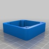

# M5Stack-3DPrintFiles
 
 

| |  | | |||
|--------|-------|------|--------|-----|--------|--------|
  
 
 
  

|             Title                  |  File type |  Author        | Link                                                            |
| ---------------------------------- |:---------- | :--------------| :---------------------------------------------------------      |
| **Official 3D print files**        | STL        | **M5Stack**    | https://github.com/m5stack/M5-hardware                          |
| Proto board case                   | STL        | Karl Norway    | https://www.thingiverse.com/thing:2754642                       |
| M5Stack Proto board                | DXF/DWG    | Ken Tinker     |  [http://github.com/KenTinker/M5Stack-Prototype-ACAD](https://github.com/KenTinker/M5Stack-Prototype-ACAD-Files)       |
| M5Stack-Open-6pin                  | STL        | Suzukiken      | https://www.thingiverse.com/thing:2800278                       |
| Case - Tripod Thread               | STL        | SwitchScience  | https://github.com/SWITCHSCIENCE/m5stack/tree/master/3D         |
| M5Stack Sensor Case                | STL        | Mario Rosas    | https://github.com/mrosasgit/M5Stack3D                          |
| Custom Proto board                 | Easy EDA   | Zazardev       | https://easyeda.com/zazarltd                                    |
| Custom Proto & Case                | Various    | Zazardev       | https://github.com/zazardev/M5Stack-Proto                       |
 
 
 

**"Make a Case of M5Stack"** *by Macsbug*  

Detailed article discussing and demonstrating the creation of custom case extensions for the M5Stack.  

Open link using Chrome for English translation  -  [Click here](https://macsbug.wordpress.com/2018/03/09/make-a-case-of-m5stack/)

